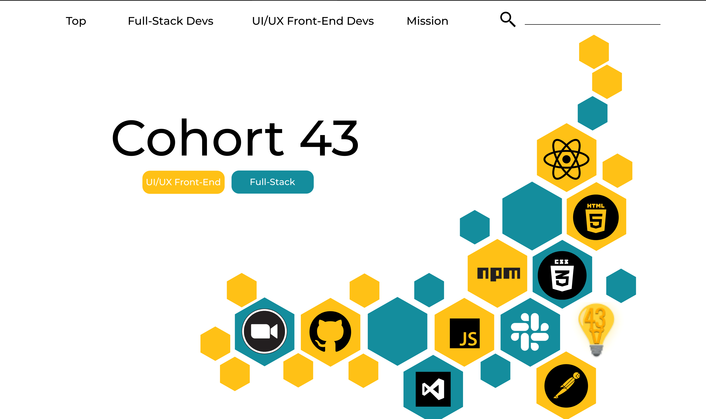
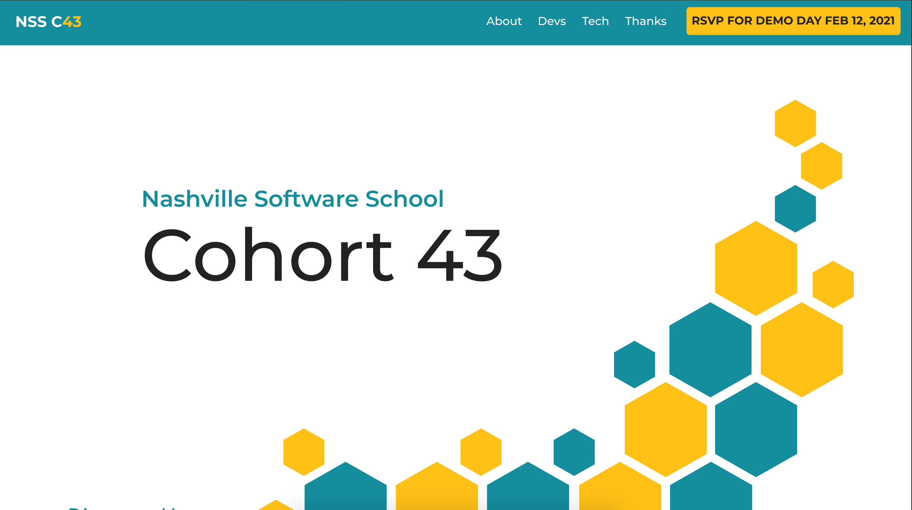
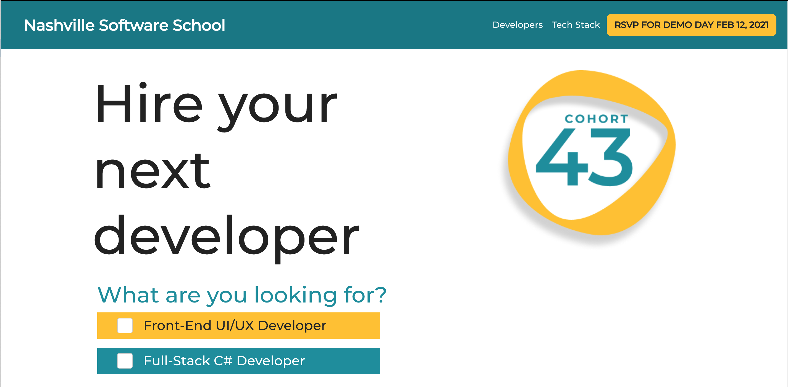

# Welcome to Nashville Software School's Cohort 43 Class Website

View the live site [here](https://nss-day-cohort-43.github.io/)

## Project Overview

## Challenge Statement

How might we promote Demo Day and showcase Cohort 43’s dual skill sets to potential employers with the ultimate goal of employment?

## Planning

This project started off with the class splitting into 2 teams to wireframe and mock up a class site, with the end goal of showcasing our designs, defending them and compromising on which project we should move ahead with.

 

After discussion, we realized both teams brought good ideas to the table. We decided to merge the 2 into a hybrid design. 

One team used Pantone's color of the year for 2021, Illuminating, with a teal that paired well with it. The bright gold color felt fresh and exciting - a new beginning. We wanted to convey that as new hires, we can provide a fresh and aspirational face to any company that might consider hiring us. 

The other team had a clear, card based layout that displayed the students in a clear and effective manner. We liked the way this layout showed the technologies our cohort learned over our time at NSS.

We came together and created a new mockup.

## User Testing

We began user testing with 3 development professionals. We took their feedback and improved our site. We did 2 more rounds of user testing and decided on our final design.

## Lessons Learned

+ User testing from the beginning helped us make better design decisions. We realized usability trumps innovative design.
+ We learned how to facilitate remote user tests.

## To Install
In the project directory, run:
`npm install`

Followed by:

`npm start`
Runs the app in the development mode.

Open http://localhost:3000 to view it in the browser.

The page will reload if you make edits.
You will also see any lint errors in the console.

Built and designed by Cohort 43 UX/UI students:   
☕️ Colin Arel [Portfolio]() - [Github](https://github.com/cArel116)   
🐻 Devon Cox  [Portfolio](devco2011.github.io) - [Github](https://github.com/Devco2011)  
🔎 Ben Davis  [Portfolio]() - [Github](https://github.com/bcdavis)  
🐠 Aaron Gertler   [Portfolio](https://asgertler.github.io/)  -[Github](https://github.com/asgertler)  
🐱 Hanako Hashiguchi  [Portfolio]() - [Github](https://github.com/HanakoH)  
🎙 Richie Holsenback  [Portfolio](https://richieholsenback.github.io/) - [Github](https://github.com/richieholsenback)  
🐲 Hailey Rissolo  [Portfolio](https://hrissolo.github.io/) - [Github](https://github.com/hrissolo)  
📸 Audrey Thomasson  [Portfolio](audreythomasson.github.io) - [Github](https://github.com/AudreyThomasson)  
